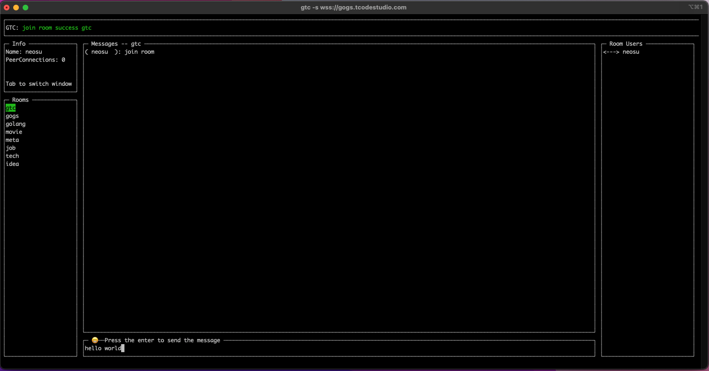

# gtc: Golang Terminal Chat


gtc is a p2p terminal chat app, using webrtc. All conversation content will not pass through the server.


## Getting Started

### Install

```bash
go install github.com/szpnygo/gtc@v0.2.4
```

or you can download from release

### Quick Run
```bash
gtc -s wss://gogs.tcodestudio.com
```

### Use your own service
```bash
gtc server -r golang,movie,meta,job,tech,idea
gtc -s ws://127.0.0.1:8888
```

### Docker

[Docker](https://hub.docker.com/r/neosu/gtc)

### TURN and STUN Server

[coturn](https://github.com/coturn/coturn)

## License
[Apache License Version 2.0](./LICENSE)
